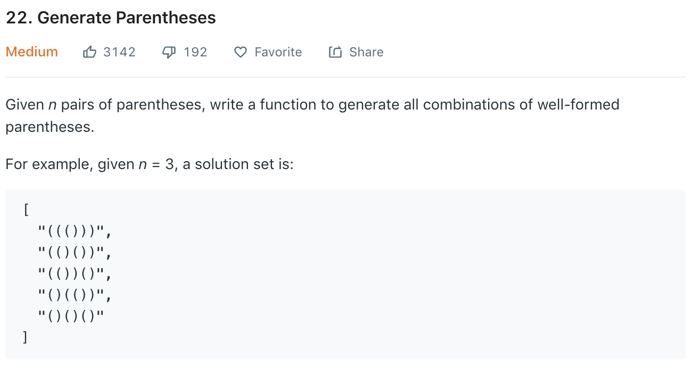
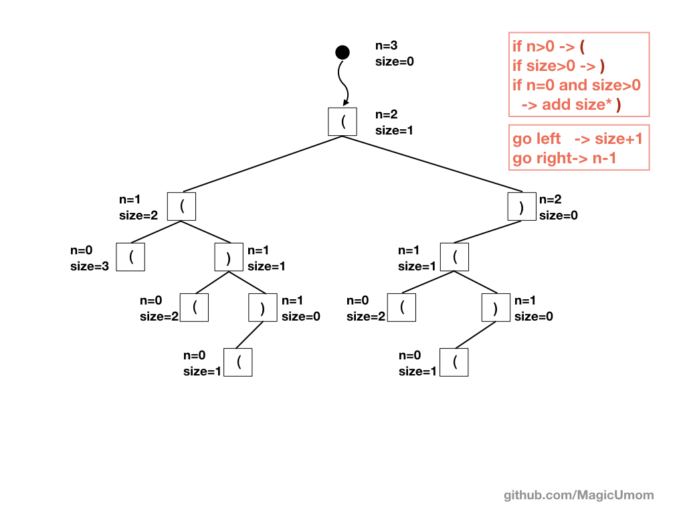
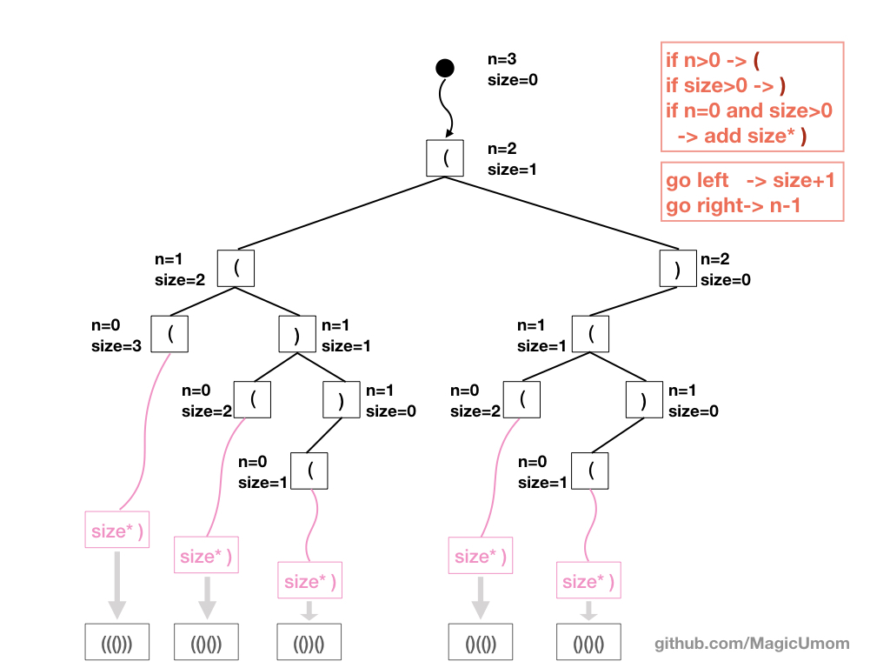

[答案連結](https://nbviewer.jupyter.org/github/MagicUmom/leetcode_python/blob/master/)

---

# Solution 
**時間複雜度 O(??)**

在上圖中，有兩個重要的參數，一個是n，一個是size。
> n 是題目給定的，代表著還有多少左括號 '(' 尚未處理
> size 是目前stack內有多少個左括號 '(' 要處理

### 1. 左分支
當n>0時，代表還有左括號要處理，所以可以往左邊長一個分支
長左分支時，n-1, size+1

### 2. 右分支
當size>0時，代表還有左括號要處理，所以可以往左邊長一個分支，
長右分支時，n不變, size-1

### 3. 停止條件
當 n=0 and size>0時，代表剩下stack內有左括號要處理
則看size為多少，補上size個右括號

---

