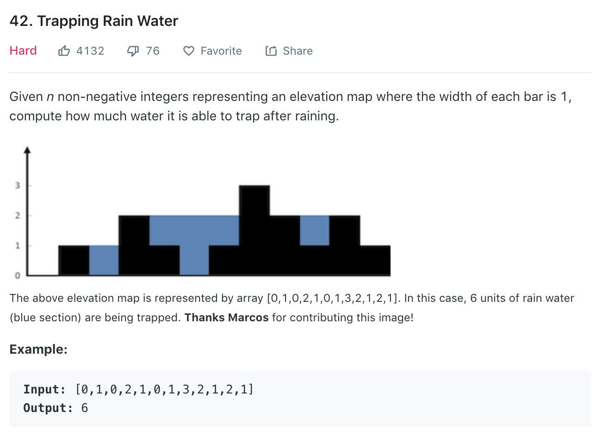

[答案連結](https://nbviewer.jupyter.org/github/MagicUmom/leetcode_python/blob/master/42_Trapping_Rain_Water/Ans.ipynb)

---



# Solution 
**時間複雜度 O(n)**

從最兩邊邊界不為0的地方開始向中間夾擊，如果往中間夾的過程遇到高度比邊界高或等於時，就能裝到水。

```
##左邊比右邊邊界高,所以右邊向內夾
if (height[L] > height[R]):
    判斷 height[R] 和  height[R-1]
    如果 height[R] < height[R-1] 則裝不了水
    反之能裝 height[R] - height[R-1]的水

else:
    與上相反
    
```

---

